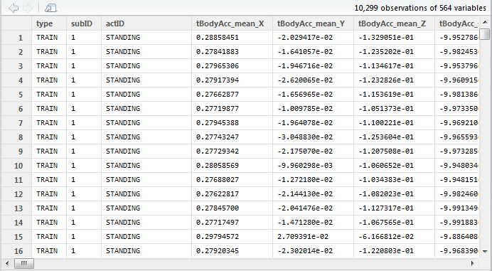
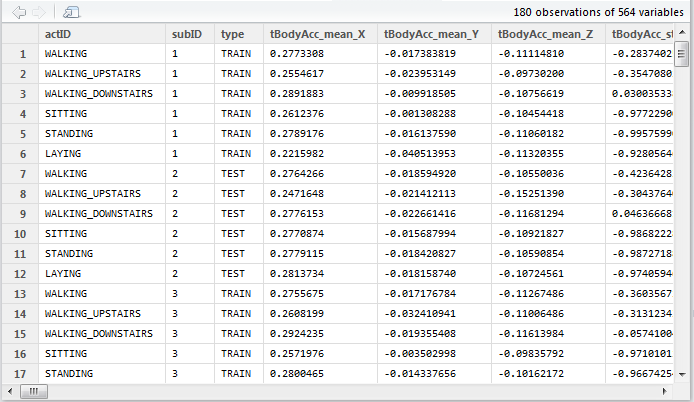

### Introduction

This file documents my effort to complete the CourseProject for Coursera
JHU Data Science GettingCleaningData, July 2014.  The purpose of this project
is to demonstrate my ability to collect, work with, and clean a data set. The
goal is to prepare tidy data that can be used for later analysis. 

R script file run_analysis.R (hereafter referred to as the script) was
developed and performs everything required.  It does not source other script
files.

### Input dataset and brief description

Prior to running the script, the dataset should be downloaded from

https://d396qusza40orc.cloudfront.net/getdata%2Fprojectfiles%2FUCI%20HAR%20Dataset.zip

Manually unzip it to your R working directory containing the script.  The 
unzipped foldername is "UCI HAR Dataset".  It contains training and test data
samples taken from a Samsung Galaxy S smartphone for 30 individuals.  The
samples and additional derived data are from a 3D accelerometer and 3D gyro
sensors.  There are 561 measurement variable columns of data.  For more
explanation, refer to the descriptive files in the unzipped folder
"UCI HAR Dataset".

### Project Assignment Instructions

1.	Merges the training and the test sets to create one data set.
2.	Extracts only the measurements on the mean and standard deviation for each measurement. 
3.	Uses descriptive activity names to name the activities in the data set
4.	Appropriately labels the data set with descriptive variable names. 
5.	Creates a second, independent tidy data set with the average of each variable for each activity and each subject. 

### Toplevel description of `run_analysis.R` script

The script is sprinkled with comments above the code that refers to assignment
instructions 1-5.  The code is further commented with sub-steps.  Thus STEP 1a,
STEP 1b, etc. are sub-steps of assignment instruction #1.

Three R data.frames and one file are created by the script; each contains 3
additional columns that identify the subject (integer), the subject class
{ TRAIN, TEST }, and the subject activity { WALKING, WALKING_UPSTAIRS, WALKING,
WALKING_DOWNSTAIRS, SITTING, STANDING, LAYING }.    The last 2 columns have
been converted to “factor” variables in R.

1.	data.frame `combined` is the concatenation (not the "merge") of the
training and test data.  Rows were not reordered.
2.	data.frame `extracted` is the same as `combined` except for
removal of column measurements that do not contain the substrings “mean” or
“std”.  This is my interpretation of assignment instruction 2.
3.	data.frame `tidy_dataset` contains the mean of all measurement columns
of the large concatenated data.frame, per subject and per activity.  It
contains 30*6=180 rows representing the subjects and their activities, each
row containing the 561 measurement columns.
4.	file `tidy_dataset.csv` is created, approximately 1.8 megabytes.  Use the
following R code snippet to read it.

`getit <- read.csv("tidy_dataset.csv", stringsAsFactors = TRUE)`

Consult file `CodeBook.md` for more details.

### snapshot of `combined` data.frame

similar for `extracted` data.frame, except fewer columns (not shown)

### snapshot of `tidy_dataset` data.frame

